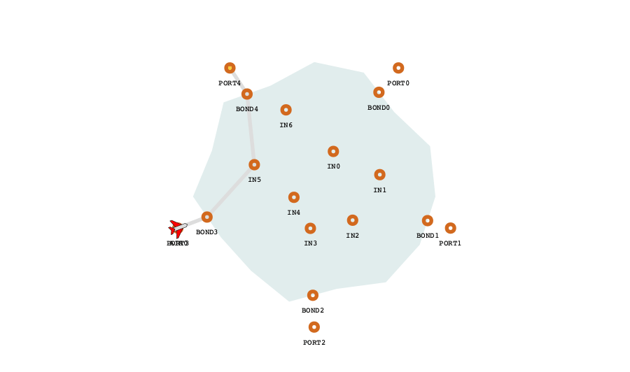

# BluebirdATC 

BluebirdATC is an open-source digital twin of en route airspace, developed by [Project Bluebird](https://www.turing.ac.uk/science-innovation/defence-and-national-security/project-bluebird), a collaboration between the Alan Turing Institute, the University of Exeter and NATS. It provides a safe, reproducible sandbox to simulate realistic air traffic scenarios, develop autonomous ATC agents, and benchmark their performance.



## Packages

This repository contains the following packages:

| Package | Purpose |
| --- | --- |
| [](https://pypi.org/project/bluebird-dt/) | The digital twin — simulate airspace, aircraft, and actions. [Docs](bluebird-dt/README.md) |
| [](https://pypi.org/project/bluebird-api/) | A REST API server for the digital twin. [Docs](bluebird-api/README.md) |
| [](https://pypi.org/project/bluebird-gymnasium/) | Gymnasium environments — train RL agents, single & multi-agent. [Docs](bluebird-gymnasium/README.md) |
| `bluebird-hmi` | An optional web-based visualisation package. [Docs](bluebird-hmi/README.md) |

## AI(r) Traffic Controller Challenge

Project Bluebird are hosting a AI agent development competition, the *AI(r) Traffic Controller Challenge*.

To get started with the competition specific setup see the docs [here](https://docs.projectbluebird.ai/examples/competition/Competition-Intro/).

## Quick start

To get started with viewing a scenario in the HMI - make sure uv is installed [(installation guide)](https://docs.astral.sh/uv/getting-started/installation/) and then run the following command in a terminal:

```bash
uvx bluebird-api@latest
```

Then navigate to [http://localhost:8000/hmi/](http://localhost:8000/hmi/).

You'll see a radar HMI with no scenario loaded. To load a simple I-Sector scenario:

1. Select **Load new scenario** in the top left
2. Choose **Artificial** → **I-Sector Two Aircraft** → **Load**
3. Press the **play** icon in the top left

Aircraft will appear in the sector and begin moving. Each label shows the callsign, current flight level, groundspeed, and cleared and exit flight levels - the same information a real ATCO sees on their radar display.

## Developing agents

To get started with agent development, we have provides some examples for interfacing with the digital twin:

* [here](bluebird-dt/README.md#getting-started) to directly interact with the digital twin
* [here](bluebird-gymnasium/README.md#getting-started) for using the gymnasium
* [here](bluebird-api/README.md#getting-started) for using the REST API from any language

## Documentation

Full documentation for the latest release is at [https://docs.projectbluebird.ai](https://docs.projectbluebird.ai).

## Contributing

Please see the [contribution guidelines](CONTRIBUTING.md) if you would like to contribute to BluebirdATC.

<div align="center"></div>
