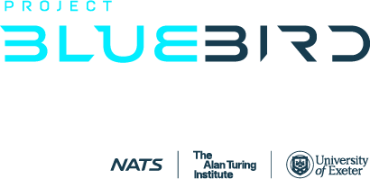

# Bluebird Gymnasium [](https://pypi.org/project/bluebird-gymnasium/) 

`bluebird-gymnasium` is suite of gymnasium environments for air traffic control (ATC).
The environments are based on [bluebird-dt](https://github.com/project-bluebird/BluebirdATC/tree/main/bluebird-dt) (an ATC simulator).
The environments support research in agent-based learning (e.g. reinforcement learning) for ATC.
It supports either single agent or multi-agents scenarios.
## Installation

Install from PyPI:

```bash
pip install bluebird-gymnasium
```

Or, if you're using [uv](https://docs.astral.sh/uv/), you can add it to your environment:

```bash
uv add bluebird-gymnasium
```

## Getting started

### Basic usage

`bluebird-gymnasium` currently supports the following environments/airspace:
X sector, Y sector, I sector, Xplus sector and Springfield sector.

To instantiate a X sector environment with the default config, run:

```python
import gymnasium as gym
import bluebird_gymnasium
env = gym.make("SectorXEnv-v0")
```

### Sample agents

Below, an example agent that takes random actions.

```python
import gymnasium as gym
import bluebird_gymnasium

env = gym.make("SectorXEnv-v0")
obs, info = env.reset()
done = False

while not done:
    action = env.action_space.sample()
    obs, reward, done, truncated, info = env.step(action)
```
## Documentation

The documentation of the latest release is available at [https://docs.projectbluebird.ai](https://docs.projectbluebird.ai).

<div align="center"></div>