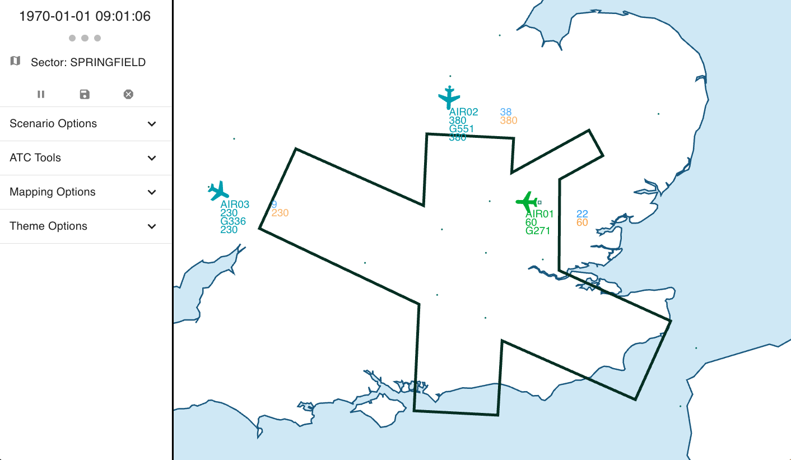

---
title: 'BluebirdATC: A Digital Twin for Air Traffic Control simulation and agent development'
tags:
  - Python
  - Digital Twin
  - Air Traffic Control
  - Autonomous Agents
  - Reinforcement Learning

date: 23 July 2026

authors:
  - name: Nick Barlow
    orcid: 0000-0003-3284-5342
    corresponding: true
    affiliation: 1
  - name: Giles Bartlett
    affiliation: 3
  - name: Ese Benjamin
    orcid: 0000-0002-1176-866X
    affiliation: 1
  - name: Richard Cannon
    affiliation: 3
  - name: Ben Carvell
    affiliation: 3
  - name: Stephen Cook
    affiliation: 2
  - name: George de Ath
    orcid: 0000-0003-4909-0257
    affiliation: 2
  - name: Tim Dodwell
    orcid: 0000-0003-0408-200X
    affiliation: "2,4"
  - name: Richard Everson
    orcid: 0000-0002-3964-1150
    affiliation: "1,2"
  - name: Sam Featherstone
    affiliation: 3
  - name: Evelina Gabasova
    orcid: 0000-0002-3707-0657
    affiliation: 1
  - name: Dewi Gould
    orcid: 0000-0002-8356-8966
    affiliation: 1
  - name: Mark Grimes
    affiliation: 3
  - name: Felicity Guest
    orcid: 0000-0002-9489-5786
    affiliation: 2
  - name: Ed Henderson
    orcid: 0000-0003-3752-4054
    affiliation: 1
  - name: Amy Hodgkin
    orcid: 0000-0002-6596-0286
    affiliation: 1
  - name: Kasra Hosseini
    orcid: 0000-0003-4396-6019
    affiliation: 1
  - name: Radka Jersakova
    orcid: 0000-0001-6846-7158
    affiliation: 1
  - name: Matt Johns
    affiliation: 2
  - name: Adam Keane
    orcid: 0000-0001-7496-6746
    affiliation: 1
  - name: Simon Kirby
    affiliation: 2
  - name: John Korna
    affiliation: 3
  - name: Frankie Kyle
    affiliation: 3
  - name: Grigorios Mingas
    orcid: 0000-0002-7880-2420
    affiliation: 1
  - name: Elhassan Mohamed
    orcid: 0000-0001-9746-1564
    affiliation: 1
  - name: Martin Layton
    affiliation: 2
  - name: Helen Little
    orcid: 0000-0002-0897-7188
    affilation: 1
  - name: John Luff
    affiliation: 2
  - name: Ricky Oliver
    affiliation: 2
  - name: Nick Pepper
    orcid: 0000-0003-2829-6774
    affiliation: 1
  - name: Mike Plummer
    affiliation: 3
  - name: Bilal Sattar
    affiliation: 3
  - name: Alvaro Sierra Castro
    affiliation: 3
  - name: Linus Tata
    affiliation: 2
  - name: Marc Thomas
    orcid: 0000-0002-2768-206X
    affiliation: 3
  - name: Tom Wilson
    orcid: 0009-0009-8270-811X
    affiliation: 2
  - name: Freddy Wordingham
    orcid: 0009-0008-4240-3090
    affiliation: "2,4"

affiliations:
  - name: The Alan Turing Institute, London, UK
    index: 1
  - name: The University of Exeter, UK
    index: 2
  - name: NATS, UK
    index: 3
  - name: digiLab, UK
    index: 4
bibliography: paper.bib

----

# Summary

BluebirdATC is an open-source framework for modelling tactical air traffic control (ATC) scenarios and developing and evaluating AI agents to control them. It combines a modular airspace simulator, a Gymnasium-compatible [@gymnasium] environment, a REST API, and a browser-based radar-style human interface.

The framework supports reproducible scenarios, deterministic and probabilistic trajectory modelling, and single and multi-agent experiments. Developed as part of Project Bluebird [@bluebird], BluebirdATC is intended for academic and industrial research on air traffic control automation.

# Statement of need

The challenge of automating air traffic control has engaged academia and industry alike for more than 40 years. A broad range of research has been undertaken towards this goal, from early simulation-based efforts [@Wesson] to many industrial programmes in Eurocontrol [@ARC2000, @HIPS, @ARGOS] and substantial efforts in SESAR [@AGENT, @JARVIS, @ATC-TBO]. However, despite this rich history of research, no Air Navigation Service Provider anywhere in the world has a system currently in operation which fully automates the process of making executive decisions to control aircraft.

To enable academic research to effectively transition to industrial impact, the need is apparent for a virtual environment which accurately represents airspace structures, aircraft behaviours, controller actions and operational uncertainty at a sufficient fidelity to reproduce important tactical control challenges. At present, operational systems and data are difficult for researchers to access, and substantial domain knowledge is required to construct credible environments.

BluebirdATC addresses these barriers by providing an open-source, domain-informed simulation framework for agent development on tactical ATC. The intended users include academic and industrial researchers working on ATC automation, and reinforcement-learning and other AI-agent researchers seeking operationally informed environments which provide a domain pathway to impact.

# State of the field

BluebirdATC joins a broader family of ATC simulators, but makes a distinct contribution through a focus on operational realism and direct support for the creation of AI agents.

The ELSA Agent-Based Model [@ELSA] was developed in SESAR for multi-aircraft simulation, but is no longer maintained. More recently AirTrafficSim [@AirTrafficSim] was released for the evaluation of ATM algorithms, but is also no longer in active development. NASA has a significant presence in ATC simulation, but their flagship tools such as MACS [@MACS] and FACET [@FACET] remain proprietary.

BlueSky is an established open-source package for simulating and visualising air traffic [@Bluesky]. Together with BlueSky-Gym [@BlueskyGym], it has been used in a range of air traffic management and reinforcement-learning applications [@Brittain:2019], and is currently the most widely used open source ATC simulation.
However, BlueSky-Gym offers only a limited set of pre-defined scenarios, which largely reduce the ATC problem to one of obstacle avoidance. Furthermore, the majority of these scenarios restrict control to a single aircraft, limiting the scope of the action space.

BluebirdATC is complementary to these tools. Its emphasis is the development and evaluation of automated agents for tactical ATC. Its domain model explicitly represents sectors, inter-sector coordination tasks and controller actions.

It also provides:
* deterministic and probabilistic trajectory models, allowing investigations into the robustness of control under uncertainty.
* a gymnasium environment for single and multi-agent scenarios.
* an optional REST API for remote AI agents and visualisation clients.
* synthetic scenarios and sectors that allow AI agent researchers to engage with the core controlling task with minimal domain knowledge
* scenario and event abstractions which allow easier integration of operational data, including historical flight data and real-world geometries.

These capabilities allow researchers to focus on tactical control of aircraft, coordination between sectors, and the evaluation of agents in domain-informed ATC scenarios.

# Software design

**BluebirdATC** comprises four main modular sub-packages, maintaining a strict separation between the simulation core (the `bluebird-dt` package) and the interfaces through which it is used. The `bluebird-gymnasium` package provides the gymnasium environment for reinforcement learning, `bluebird-api` enables a mechanism for communication with AI agents and remote services, and `bluebird-hmi` is a client of the API that provides a radar-style visualisation of the airspace and aircraft in it.

The software is written primarily in Python, which was chosen for its maintainability and human-readability, excellent third-party packages (e.g. pandas, numpy), as well as its widespread use among the AI/ML communities.

## 1. `bluebird-dt`
This "Digital Twin" Python package, so named as it forms the core of the Digital Twin of UK airspace developed by Project Bluebird [@bluebird], enables simulation of "en-route airspace", i.e. not concerned with take-offs, landings, low flying aircraft, military.  This limited scope is
chosen in order to keep the aircraft performance modelling tractable, and to target the specific research problem of tactical ATC.

The package consists of:
 * classes representing ATC concepts, including aircraft, sectors, fixes and an overall `Environment` class.
 * interchangeable `Predictors` that estimate aircraft movement between simulation time steps.
 * infrastructure classes for managing scenarios, environments, events and simulation state.
 * utility functions such as for unit conversion, calculating geographic transformations, reading aircraft data files.

The simulator also processes actions, which are instructions to a given aircraft, such as changes to heading, altitude, or speed, and passing control to the next sector.

Users initialise the simulator with a pre-defined scenario and advance it with the `evolve(time_period)` method. A key feature of `bluebird-dt` is its modularity which allows most components to be replaced, provided they conform to the specified interface. For example, this package includes both deterministic and probabilistic predictors, with the former giving reproducible baselines and fast training, and the latter capturing real-world uncertainties in aircraft performance.

## 2. `bluebird-gymnasium`

The Gymnasium API [@gymnasium] provides a standard interface between reinforcement learning (RL) agents and their environments. The `bluebird-gymnasium` Python package wraps `bluebird-dt` providing a gymnasium interface, including a set of reward functions, action space definition, and environment state representation. This reduces the amount of ATC specific knowledge and integration required by agent developers, as existing RL libraries and baselines work unchanged. It is designed for RL and other agent research, and supports both single-agent and multi-agent RL approaches.

## 3. `bluebird-api`

The `bluebird-api` package wraps `bluebird-dt`, using FastAPI [@FastAPI] to provide a REST interface for loading, starting, pausing and stopping simulated scenarios, retrieving simulation state, and for sending actions to aircraft.

Whilst direct Python interaction via `bluebird-gymnasium` is generally preferable for high-throughput agent training, the API is intended for cases where agents run remotely or are written in other languages, and to connect frontend applications such as `bluebird-hmi`.

## 4. `bluebird-hmi`

The `bluebird-hmi` package is a typescript/React [@React] frontend application providing a radar-style view of the simulated airspace. For convenience the built application is included in the repository, and served as a static page via `bluebird-api`. Should users wish to customise their display, the typescript source code is also available for modification.

The display shows the "radar" view that an air traffic control officer (ATCO) would have of the airspace they are controlling, including sector boundaries, navigation fixes, aircraft positions, recent trail dots and data blocks containing callsign, current and target flight levels, and other relevant information.

Several stylistic display modes are available in addition to the operational-style default, for example, the "presentation mode"\autoref{fig:hmi_screenshot} is suitable for lay audiences.

## Documentation and tutorials

Web documentation [@bluebirdDocs], built with MkDocs [@MkDocs] covers installation and package use. Jupyter notebooks [@Jupyter] in the `bluebird-dt/examples` and `bluebird-gymnasium/examples` directories provide introductory guides to using the simulator and the gymnasium environment.

# Research impact statement

BluebirdATC has provided the core simulation and agent-interface layer for research within Project Bluebird.
It has been used to create a digital twin of UK airspace [@BluebirdDigitalTwin:2026], to develop and evaluate AI agents [@HumanInTheLoop:2026], for machine-machine and human-machine trials, and for public, stakeholder and regulator engagement.

### Digital Twin Research

Within Project Bluebird, BluebirdATC was extended with proprietary modules that ingest live and historical operational data supplied by NATS, the UK's primary air traffic control provider [@BluebirdDigitalTwin:2026]. The resulting digital twin can shadow live operations, replay historical traffic, or operate in a hybrid mode in which traffic outside a defined boundary follows operational data while aircraft within or reaching the boundary is simulated and controllable.

The REST interface allows multiple clients to use a shared simulation across a network. This has supported experiments involving adjacent sectors controlled by combinations of human air traffic controllers and AI agents. Controller feedback from these trials informed the assessment and refinement of agent behaviour, the simulation and the human-machine interface.

### Human-in-the-loop Testing of AI Agents

BluebirdATC has also been used to construct a rigorous human-in-the-loop evaluation framework for evaluating AI agents based on parts of the regulator-certified curriculum used at NATS for human controller training [@HumanInTheLoop:2026]. Specialised `scenario_manager` and `predictor` modules reproduced relevant curriculum scenarios, which were used to train and assess rules-based, optimisation-based, graph-search and reinforcement learning agents. Qualified controllers and instructors could then assess agent performance against operationally grounded expectations.

### Research Outputs, Public and Regulator Engagement

BluebirdATC is the core software of Project Bluebird, where it has enabled research and conference papers on digital twins, probabilistic trajectory prediction, AI agents development, and human-in-the-loop evaluation [@BluebirdDigitalTwin:2026; @HumanInTheLoop:2026; @ProbabilisticClimb:2023; @TrajectoryGeneration:2025; @TransparentAgents:2025; @ActionStacking:2026; @GenerativeClimb:2024; @FutureCapabilitiesAgent:2026; @AccuracyFidelity:2026; @ConditioningTrajectoryPrediction:2026]
The framework has also been demonstrated in workshops with regulators and industrial partners. It also formed the basis of a STEM outreach ATC game used at schools and multiple events including the British Science Festival, the Farnborough Airshow and aviation conferences.

# AI usage disclosure

The vast majority of software in **BluebirdATC** was written with no input from AI tools.

Some recent additions and fixes have been made with the help of coding assistants -specifically Copilot (using GPT-4/5), and Claude 4. Some developers have used these tools in their IDEs, while others have used the chat interface, asking the tool for solutions to abstracted version of specific problems.

All pull requests are reviewed by project members before merging, and contributors are asked (via the CONTRIBUTING.md) to disclose their use of AI tools.

Large language models assisted with some phrasing in this manuscript.

# Acknowledgements

This work was supported by the EPSRC (EP/V056522/1) and NATS.

# References